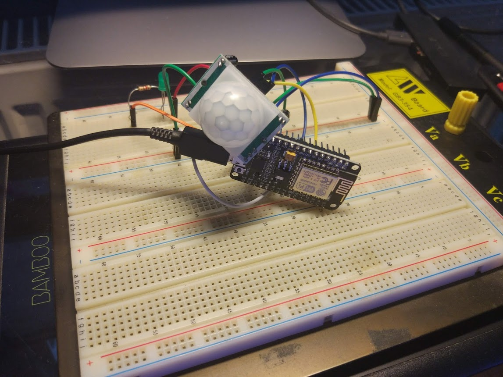
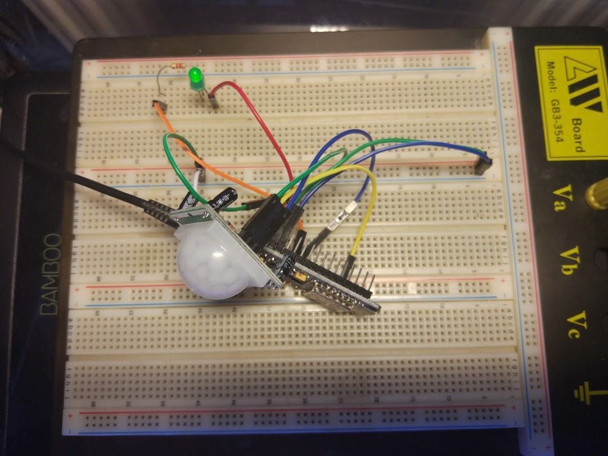

# IoT-Motion-Detector
An IoT project with NodeMCU and Blynk. 
Any time that a movement is detected by the sensor, the green LED lights up and a message is sent to a smartphone.
## Materials
* NodeMCU ESP12
* Motion Sensor HC-SR501
* Resistor (120 Ohm)
* LED
* Breadboard
* Cables

